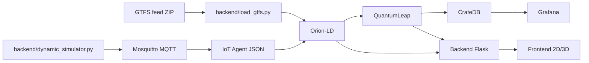

# XDEI P3 - FIWARE Urban Mobility

Repositorio para simular, monitorizar y analizar movilidad urbana con FIWARE y NGSI-LD.

Este README es la guia principal de arranque y uso local. Para detalle funcional y de modelo:
- `architecture.md`
- `data_model.md`
- `PRD.md`

## Quick Start

### Requisitos

- Docker + Docker Compose plugin (`docker compose`)
- Navegador moderno (Chrome/Firefox) para visualización 3D

### 🚀 Arranque en un solo paso (Recomendado)

El script `start.sh` automatiza todo el proceso: levanta contenedores, verifica la salud de los servicios, **siembra 7 días de datos históricos** en CrateDB e ingiere los datos estáticos GTFS.

```bash
bash start.sh
```

### Acceso a la Plataforma

1. **Frontend**: [http://localhost:8081](http://localhost:8081)
   - **Login**: Credenciales por defecto `admin` / `admin`.
   - El acceso al resto de la app está restringido hasta iniciar sesión.
2. **Dashboard Analítico**: Integrado en la sección de "Predicción / Analítica" del menú lateral.
3. **API Backend**: [http://localhost:1026/v2](http://localhost:1026/v2) (Orion) | [http://localhost:8000](http://localhost:8000) (Custom API).

### Servicios y puertos

- Mosquitto MQTT: `1883`
- Orion-LD: `1026`
- IoT Agent JSON: `4041`
- CrateDB: `4200`
- QuantumLeap: `8668`
- Grafana: `3000`
- Backend Flask: `8000`
- Frontend Nginx: `8081`

## Características Principales

### 🔐 Seguridad y Autenticación
*   **Landing Page**: Nueva interfaz de inicio con diseño premium (glassmorphism).
*   **Control de Acceso**: Menú de navegación persistente (hamburguesa) que se activa tras el login exitoso.

### 🗺️ Visualización Avanzada
*   **Mapa 2D**: Monitorización en tiempo real de la flota sobre Leaflet.
*   **Escena 3D**: Visualización inmersiva con Three.js y HUD informativo (descartable).
*   **Analítica**: Cuadro de mando integrado con 4 paneles clave:
    *   **Ocupación Media Global**: Indicador tipo Gauge con umbrales de estado.
    *   **Universidad vs Hospitales**: Comparativa de demanda por destino principal.
    *   **Peak Hours**: Análisis de franjas horarias críticas.
    *   **Top 10 Vehículos**: Ranking de unidades con mayor saturación.

### ⚙️ Automatización y DevOps
*   **Sembrado Inteligente**: Generación automática de 7 días de telemetría sintética al arrancar.
*   **Orquestación**: Gestión de dependencias y salud de servicios (Orion-LD, CrateDB, QuantumLeap) integrada en el arranque.

## Arquitectura

El sistema sigue una arquitectura FIWARE de vanguardia:
- **Capa Estática**: Ingesta GTFS a Orion-LD.
- **Capa Dinámica**: Simulador de vehículos vía MQTT (IoT Agent).
- **Persistencia**: QuantumLeap almacenando en CrateDB (Postgres compatible).
- **Análisis**: Grafana con tema esmeralda y light-mode optimizado.



Arquitectura detallada y flujos extendidos: `architecture.md`.

## API Examples

Base URL local:

```bash
BASE_URL=http://localhost:8000
```

### 1) Health

```bash
curl "$BASE_URL/health"
```

### 2) Ping

```bash
curl "$BASE_URL/api/ping"
```

### 3) Login (JWT de desarrollo)

```bash
curl -X POST "$BASE_URL/api/login" \
  -H "Content-Type: application/json" \
  -d '{"username":"demo","password":"demo"}'
```

Guardar token:

```bash
TOKEN=$(curl -s -X POST "$BASE_URL/api/login" \
  -H "Content-Type: application/json" \
  -d '{"username":"demo","password":"demo"}' | python -c 'import sys, json; print(json.load(sys.stdin)["token"])')
```

### 4) Rutas, paradas y vehiculos actuales

```bash
curl "$BASE_URL/api/routes"
curl "$BASE_URL/api/stops"
curl "$BASE_URL/api/vehicles/current"
```

### 5) Historico de vehiculos

```bash
curl "$BASE_URL/api/vehicles/history?page=1&pageSize=20"
curl "$BASE_URL/api/vehicles/history?fromDate=2026-05-01T00:00:00Z&toDate=2026-05-01T01:00:00Z"
```

### 6) Prediccion puntual

```bash
curl -X POST "$BASE_URL/api/predict" \
  -H "Content-Type: application/json" \
  -d '{
    "stopId": "urn:ngsi-ld:GtfsStop:s1",
    "horizonMinutes": 30
  }'
```

### 7) Prediccion por parada (serie)

```bash
curl "$BASE_URL/api/stops/urn:ngsi-ld:GtfsStop:s1/prediction?horizonMinutes=30&seriesHorizonMinutes=120&stepMinutes=15"
```

### 8) Endpoints de usuario/gamificacion (requieren JWT)

```bash
# Perfil
curl "$BASE_URL/api/user/demo/profile" \
  -H "Authorization: Bearer $TOKEN"

# Registrar viaje
curl -X POST "$BASE_URL/api/user/record-trip" \
  -H "Authorization: Bearer $TOKEN" \
  -H "Content-Type: application/json" \
  -d '{"tripId":"urn:ngsi-ld:GtfsTrip:t1","stopId":"urn:ngsi-ld:GtfsStop:s1"}'

# Canjear puntos
curl -X POST "$BASE_URL/api/user/redeem" \
  -H "Authorization: Bearer $TOKEN" \
  -H "Content-Type: application/json" \
  -d '{"discountCode":"DISC-001","pointsCost":50,"discountValue":10}'
```

## Scripts de datos

### GTFS

Validar feed antes de cargar:

```bash
python backend/validate_gtfs.py /ruta/feed.zip
```

Opciones utiles:

```bash
python backend/validate_gtfs.py /ruta/feed.zip --verbose --validate-ngsi-ld
python backend/validate_gtfs.py /ruta/feed.zip --json
```

Cargar feed en Orion-LD:

```bash
python backend/load_gtfs.py /ruta/feed.zip --batch-size 100
```

Dry-run sin upsert real:

```bash
python backend/load_gtfs.py /ruta/feed.zip --dry-run --json
```

### Dataset ML

Generar dataset desde historico (QuantumLeap + Orion):

```bash
python scripts/generate_ml_dataset.py \
  --days-back 7 \
  --output /tmp/occupancy_dataset.csv
```

Con muestreo e imputacion:

```bash
python scripts/generate_ml_dataset.py \
  --days-back 14 \
  --output /tmp/occupancy_dataset.csv \
  --sample-size 5000 \
  --impute mean
```

### Entrenamiento de modelo

```bash
python scripts/train_model.py \
  --dataset /tmp/occupancy_dataset.csv \
  --model-output backend/models/occupancy_model.pkl
```

Con busqueda basica de hiperparametros:

```bash
python scripts/train_model.py \
  --dataset /tmp/occupancy_dataset.csv \
  --model-output backend/models/occupancy_model.pkl \
  --grid-search
```

### Seed de gamificacion

Preview sin subir a Orion:

```bash
python scripts/seed_gamification.py --user-count 8 --dry-run
```

Subida real:

```bash
python scripts/seed_gamification.py --user-count 8
```

Documentacion detallada de scripts:
- `scripts/GENERATE_ML_DATASET_README.md`
- `scripts/GAMIFICATION_SEED_README.md`

## Dashboards Grafana

Se provisionan automaticamente al arrancar Grafana:
- Delays: http://localhost:3000/d/delays
- Occupancy: http://localhost:3000/d/occupancy
- Volume: http://localhost:3000/d/volume

Nota: para ver datos, debe haber entidades `VehicleState` actualizandose en Orion-LD y persistidas en CrateDB via QuantumLeap.

## Troubleshooting rapido

### El backend no responde

```bash
docker compose ps
docker compose logs backend --tail 100
```

### Health degradado

- Revisar que Orion-LD (`1026`), QuantumLeap (`8668`) y Mosquitto (`1883`) esten vivos.
- Comprobar cabeceras FIWARE consistentes entre scripts y backend (`Fiware-Service`, `Fiware-ServicePath`).

### Los dashboards estan vacios

- Verificar simulador activo y publicando telemetria.
- Verificar bridge MQTT/IoT Agent (`vehicle-bridge`) en ejecucion.

## Suite de Tests

La suite incluye tests unitarios e integración organizados con pytest:

### Estructura de tests

- **Unit tests**: Tests rapidos sin dependencias externas (mocks para Orion, QuantumLeap, MQTT).
  - `backend/tests/test_*.py` — API, servicios, clientes
  - `tests/test_*.py` — Simulador, utilidades
- **Integration tests**: Requieren servicios corriendo (Orion-LD, QuantumLeap, CrateDB, Mosquitto).
  - Marcados con `@pytest.mark.integration`

### Ejecucion con make

```bash
# Tests unitarios (rapido, ~10s)
make test

# Tests integracion (requiere docker compose, ~30-60s)
make test-integration

# Todos los tests
make test-all
```

### Ejecucion directa con pytest

```bash
# Solo unitarios
python -m pytest -m "not integration" -v

# Solo integracion
python -m pytest -m integration -v

# Todos
python -m pytest -v
```

### Markers y categorias

- `@pytest.mark.integration` — Test requiere servicios FIWARE activos
- Default (sin marker) — Test unitario con mocks

Ver `pytest.ini` para configuracion de markers.

### CI/CD

GitHub Actions ejecuta automaticamente:
1. **Unit tests** en `push` y `pull_request`
2. **Integration tests** en `push` y `pull_request` (levanta `docker compose`)

Ver `.github/workflows/test.yml` para detalles.

## Flujo GitHub Flow (contribucion)

1. Crear rama desde `main` por issue (`issue-31-readme-docs`).
2. Implementar cambios pequenos y trazables.
3. Ejecutar validaciones/tests (`make test`).
4. Commit con mensaje claro.
5. Push y abrir PR a `main` — CI ejecuta tests automaticamente.

## Licencia

Uso academico / proyecto docente (ajustar segun politica del curso o repositorio).
