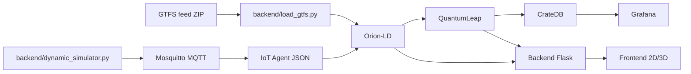

# XDEI P3 - FIWARE Urban Mobility

Repositorio para simular, monitorizar y analizar movilidad urbana con FIWARE y NGSI-LD.

Este README es la guia principal de arranque y uso local. Para detalle funcional y de modelo:
- `architecture.md`
- `data_model.md`
- `PRD.md`

## Quick Start

### Requisitos

- Docker + Docker Compose plugin (`docker compose`)
- Python 3.10+ (solo para scripts locales fuera de contenedores)

### 1) Clonar y entrar al repo

```bash
git clone <repo-url>
cd p3_xdei
```

### 2) Levantar stack completo

```bash
# Compatibilidad: tambien sirve `docker-compose up --build -d`
docker compose up --build -d
```

### 3) Comprobar salud

```bash
curl http://localhost:8000/health
```

Respuesta esperada: JSON con `status` y estado por servicio FIWARE.

### 4) Abrir interfaces

- Frontend: http://localhost:8081
- Backend API: http://localhost:8000
- Orion-LD: http://localhost:1026
- IoT Agent JSON: http://localhost:4041
- QuantumLeap: http://localhost:8668
- CrateDB admin: http://localhost:4200
- Grafana: http://localhost:3000

### Servicios y puertos

- Mosquitto MQTT: `1883`
- Orion-LD: `1026`
- IoT Agent JSON: `4041`
- CrateDB: `4200`
- QuantumLeap: `8668`
- Grafana: `3000`
- Backend Flask: `8000`
- Frontend Nginx: `8081`

### Arranque recomendado para datos de demo

```bash
# 1) Stack

docker compose up --build -d

# 2) Cargar GTFS (primero validar y luego cargar)
python backend/validate_gtfs.py /ruta/feed.zip
python backend/load_gtfs.py /ruta/feed.zip --batch-size 100

# 3) (Opcional) Sembrar gamificacion
python scripts/seed_gamification.py --user-count 8

# 4) Simular telemetria
python backend/dynamic_simulator.py --gtfs-zip /ruta/feed.zip
```

## Arquitectura

El sistema sigue una arquitectura FIWARE en capas:
- Capa GTFS estatico (`load_gtfs.py` + Orion-LD)
- Capa dinamica (simulador + MQTT)
- Ingesta operativa (IoT Agent JSON -> Orion-LD)
- Historico temporal (QuantumLeap -> CrateDB)
- API de aplicacion (Flask)
- Frontend (Leaflet, Three.js)
- Observabilidad (Grafana)



Arquitectura detallada y flujos extendidos: `architecture.md`.

## API Examples

Base URL local:

```bash
BASE_URL=http://localhost:8000
```

### 1) Health

```bash
curl "$BASE_URL/health"
```

### 2) Ping

```bash
curl "$BASE_URL/api/ping"
```

### 3) Login (JWT de desarrollo)

```bash
curl -X POST "$BASE_URL/api/login" \
  -H "Content-Type: application/json" \
  -d '{"username":"demo","password":"demo"}'
```

Guardar token:

```bash
TOKEN=$(curl -s -X POST "$BASE_URL/api/login" \
  -H "Content-Type: application/json" \
  -d '{"username":"demo","password":"demo"}' | python -c 'import sys, json; print(json.load(sys.stdin)["token"])')
```

### 4) Rutas, paradas y vehiculos actuales

```bash
curl "$BASE_URL/api/routes"
curl "$BASE_URL/api/stops"
curl "$BASE_URL/api/vehicles/current"
```

### 5) Historico de vehiculos

```bash
curl "$BASE_URL/api/vehicles/history?page=1&pageSize=20"
curl "$BASE_URL/api/vehicles/history?fromDate=2026-05-01T00:00:00Z&toDate=2026-05-01T01:00:00Z"
```

### 6) Prediccion puntual

```bash
curl -X POST "$BASE_URL/api/predict" \
  -H "Content-Type: application/json" \
  -d '{
    "stopId": "urn:ngsi-ld:GtfsStop:s1",
    "horizonMinutes": 30
  }'
```

### 7) Prediccion por parada (serie)

```bash
curl "$BASE_URL/api/stops/urn:ngsi-ld:GtfsStop:s1/prediction?horizonMinutes=30&seriesHorizonMinutes=120&stepMinutes=15"
```

### 8) Endpoints de usuario/gamificacion (requieren JWT)

```bash
# Perfil
curl "$BASE_URL/api/user/demo/profile" \
  -H "Authorization: Bearer $TOKEN"

# Registrar viaje
curl -X POST "$BASE_URL/api/user/record-trip" \
  -H "Authorization: Bearer $TOKEN" \
  -H "Content-Type: application/json" \
  -d '{"tripId":"urn:ngsi-ld:GtfsTrip:t1","stopId":"urn:ngsi-ld:GtfsStop:s1"}'

# Canjear puntos
curl -X POST "$BASE_URL/api/user/redeem" \
  -H "Authorization: Bearer $TOKEN" \
  -H "Content-Type: application/json" \
  -d '{"discountCode":"DISC-001","pointsCost":50,"discountValue":10}'
```

## Scripts de datos

### GTFS

Validar feed antes de cargar:

```bash
python backend/validate_gtfs.py /ruta/feed.zip
```

Opciones utiles:

```bash
python backend/validate_gtfs.py /ruta/feed.zip --verbose --validate-ngsi-ld
python backend/validate_gtfs.py /ruta/feed.zip --json
```

Cargar feed en Orion-LD:

```bash
python backend/load_gtfs.py /ruta/feed.zip --batch-size 100
```

Dry-run sin upsert real:

```bash
python backend/load_gtfs.py /ruta/feed.zip --dry-run --json
```

### Dataset ML

Generar dataset desde historico (QuantumLeap + Orion):

```bash
python scripts/generate_ml_dataset.py \
  --days-back 7 \
  --output /tmp/occupancy_dataset.csv
```

Con muestreo e imputacion:

```bash
python scripts/generate_ml_dataset.py \
  --days-back 14 \
  --output /tmp/occupancy_dataset.csv \
  --sample-size 5000 \
  --impute mean
```

### Entrenamiento de modelo

```bash
python scripts/train_model.py \
  --dataset /tmp/occupancy_dataset.csv \
  --model-output backend/models/occupancy_model.pkl
```

Con busqueda basica de hiperparametros:

```bash
python scripts/train_model.py \
  --dataset /tmp/occupancy_dataset.csv \
  --model-output backend/models/occupancy_model.pkl \
  --grid-search
```

### Seed de gamificacion

Preview sin subir a Orion:

```bash
python scripts/seed_gamification.py --user-count 8 --dry-run
```

Subida real:

```bash
python scripts/seed_gamification.py --user-count 8
```

Documentacion detallada de scripts:
- `scripts/GENERATE_ML_DATASET_README.md`
- `scripts/GAMIFICATION_SEED_README.md`

## Dashboards Grafana

Se provisionan automaticamente al arrancar Grafana:
- Delays: http://localhost:3000/d/delays
- Occupancy: http://localhost:3000/d/occupancy
- Volume: http://localhost:3000/d/volume

Nota: para ver datos, debe haber entidades `VehicleState` actualizandose en Orion-LD y persistidas en CrateDB via QuantumLeap.

## Troubleshooting rapido

### El backend no responde

```bash
docker compose ps
docker compose logs backend --tail 100
```

### Health degradado

- Revisar que Orion-LD (`1026`), QuantumLeap (`8668`) y Mosquitto (`1883`) esten vivos.
- Comprobar cabeceras FIWARE consistentes entre scripts y backend (`Fiware-Service`, `Fiware-ServicePath`).

### Los dashboards estan vacios

- Verificar simulador activo y publicando telemetria.
- Verificar bridge MQTT/IoT Agent (`vehicle-bridge`) en ejecucion.

## Flujo GitHub Flow (contribucion)

1. Crear rama desde `main` por issue (`issue-31-readme-docs`).
2. Implementar cambios pequenos y trazables.
3. Ejecutar validaciones/document checks.
4. Commit con mensaje claro.
5. Push y abrir PR a `main`.

## Licencia

Uso academico / proyecto docente (ajustar segun politica del curso o repositorio).
