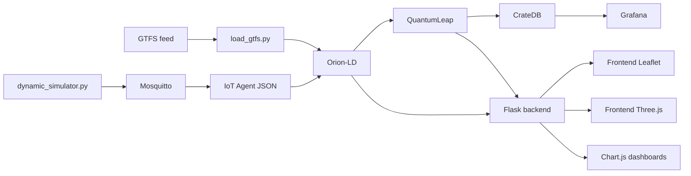

# Arquitectura - Plataforma FIWARE de movilidad urbana

## 1. Visión general

La solución sigue una arquitectura FIWARE clásica en capas, con Orion-LD como broker central de contexto, MQTT como canal de telemetría, QuantumLeap y CrateDB como persistencia temporal, y un backend Flask como orquestador funcional para predicción, gamificación y agregación de datos para el frontend.

El diseño prioriza NGSI-LD, despliegue local reproducible y separación clara entre datos estáticos GTFS y datos dinámicos operativos.

## 2. Capas del sistema

### 2.1 Capa de ingesta GTFS estático

Responsable de transformar el feed GTFS en entidades NGSI-LD.

Componentes:
- `load_gtfs.py`
- Orion-LD

Funciones:
- Parsear rutas, paradas, viajes, horarios, shapes y calendarios.
- Crear o actualizar entidades estáticas.
- Mantener identificadores reproducibles.

### 2.2 Capa de simulación dinámica

Responsable de generar la posición y estado operativo de los vehículos activos.

Componentes:
- `dynamic_simulator.py`
- fuente GTFS estática
- reloj de simulación

Funciones:
- Determinar viajes activos por fecha y hora.
- Interpolar posición sobre shapes.
- Calcular retraso, ocupación y velocidad.
- Publicar telemetría por MQTT.

### 2.3 Capa de mensajería e ingesta operativa

Responsable de llevar la telemetría al modelo de contexto.

Componentes:
- Mosquitto
- IoT Agent JSON
- Orion-LD

Funciones:
- Recibir mensajes MQTT.
- Mapear payloads al modelo NGSI-LD.
- Actualizar entidades `VehicleState`.

### 2.4 Capa de persistencia histórica

Responsable de almacenar cambios relevantes como series temporales.

Componentes:
- Orion-LD subscriptions
- QuantumLeap
- CrateDB

Funciones:
- Detectar cambios sobre atributos monitorizados.
- Persistir posiciones, retrasos, ocupación y otros valores útiles.
- Habilitar consultas históricas para el viaje en el tiempo y analítica.

### 2.5 Capa de backend de aplicación

Responsable de exponer una API REST para el frontend y encapsular lógica de negocio.

Componentes:
- Flask
- módulo de integración con Orion-LD
- módulo de integración con QuantumLeap
- módulo de predicción ML
- módulo de gamificación

Funciones:
- Consultar contexto actual.
- Consultar histórico.
- Entrenar y ejecutar predicciones de afluencia.
- Gestionar perfiles, puntos, logros y descuentos.

### 2.6 Capa de frontend

Responsable de la experiencia de usuario.

Componentes:
- Leaflet + OpenStreetMap
- Three.js
- Chart.js
- cliente API

Funciones:
- Visualización 2D de rutas, paradas y vehículos.
- Visualización 3D inmersiva.
- Control temporal.
- Gráficas de métricas.
- Panel de gamificación.

### 2.7 Capa de analítica

Responsable de dashboards técnicos.

Componentes:
- Grafana
- CrateDB

Funciones:
- Seguimiento de retrasos y ocupación.
- Consultas por línea, parada y ventana temporal.
- Visualización operativa para validación del sistema.

## 3. Diagrama lógico

## 4. Flujos de datos

### 4.1 Flujo de datos estáticos

1. Se descarga o monta el feed GTFS.
2. El loader convierte el feed en entidades NGSI-LD.
3. Orion-LD almacena rutas, paradas, viajes, horarios, shapes y servicios.
4. El backend consume estas entidades para construir vistas y relaciones.

### 4.2 Flujo de datos dinámicos

1. El simulador determina los viajes activos.
2. Calcula la posición y estado del vehículo.
3. Publica telemetría por MQTT.
4. El IoT Agent traduce el mensaje a NGSI-LD.
5. Orion-LD actualiza la entidad `VehicleState`.
6. La suscripción desencadena persistencia histórica en QuantumLeap y CrateDB.

### 4.3 Flujo de consulta en tiempo real

1. El frontend solicita datos al backend.
2. El backend consulta Orion-LD para el estado actual.
3. El frontend refresca mapa, escena 3D y gráficos.
4. Para reducir latencia percibida, el frontend puede usar polling corto o una capa de eventos si se decide en implementación.

### 4.4 Flujo de viaje en el tiempo

1. El usuario selecciona una fecha y hora.
2. El frontend solicita el histórico al backend.
3. El backend consulta QuantumLeap/CrateDB.
4. Se reconstruyen posiciones históricas y se repintan vehículos.

### 4.5 Flujo de predicción

1. El backend recupera datos históricos y contexto actual.
2. El modelo ML produce la ocupación esperada.
3. El backend devuelve la predicción al frontend.
4. Opcionalmente se publica una entidad `StopCrowdPrediction` en Orion-LD.

### 4.6 Flujo de gamificación

1. El usuario autenticado registra actividad o se asocia a un trayecto.
2. El backend actualiza su `UserProfile`.
3. Se acumulan puntos, se desbloquean logros y se registran canjes.
4. El frontend refleja el progreso y el historial de recompensas.

## 5. Despliegue local

El sistema debe levantarse de forma reproducible con Docker Compose.

### 5.1 Servicios principales

- Orion-LD
- Mosquitto
- IoT Agent JSON
- QuantumLeap
- CrateDB
- Grafana
- Backend Flask
- Frontend
- Loader GTFS
- Simulador dinámico

### 5.2 Dependencias de arranque

1. CrateDB debe estar disponible antes que QuantumLeap.
2. Orion-LD debe estar disponible antes que el IoT Agent y el backend.
3. Mosquitto debe estar listo antes que el simulador y el IoT Agent.
4. El loader GTFS debe ejecutarse antes de iniciar el simulador si este depende del contexto estático.

### 5.3 Volúmenes y persistencia

- Volumen para datos de CrateDB.
- Volumen para configuración de Grafana.
- Volumen para el feed GTFS descargado.
- Volumen opcional para modelos ML entrenados.

## 6. Backend Flask

### 6.1 Responsabilidades

- Servir endpoints para el frontend.
- Unificar acceso a contexto actual e histórico.
- Ejecutar predicción de afluencia.
- Gestionar gamificación.

### 6.2 Endpoints recomendados

- `GET /api/routes`
- `GET /api/stops`
- `GET /api/trips/active`
- `GET /api/vehicles/current`
- `GET /api/vehicles/history`
- `GET /api/stops/{id}/prediction`
- `POST /api/predict`
- `GET /api/user/profile`
- `POST /api/user/redeem`
- `GET /api/gamification/achievements`

## 7. Estrategia de actualización del frontend

La arquitectura permite dos estrategias:

1. Polling controlado desde el frontend o backend proxy.
2. Canal de eventos si se decide añadir WebSocket o Server-Sent Events.

Para una primera entrega, el polling es más simple y suficiente. Si se necesita menor latencia percibida o mejor escalabilidad visual, el backend puede evolucionar a eventos sin tocar el modelo de contexto.

## 8. Modelo temporal y monitorización

### 8.1 Histórico

- QuantumLeap actúa como traductor entre cambios de contexto y series temporales.
- CrateDB almacena los valores persistidos para consultas históricas.
- El tiempo de viaje en el tiempo depende de la granularidad de muestreo y de las entidades suscritas.

### 8.2 Observabilidad

- Logs estructurados en backend y simulador.
- Healthchecks para contenedores críticos.
- Grafana conectado a CrateDB.
- Validación periódica de conectividad entre Orion-LD, IoT Agent y QuantumLeap.

## 9. Modelo de integración con Smart Data Models transversales

El sistema debe reutilizar patrones transversales cuando aporten valor real:

- Identificadores NGSI-LD consistentes y semánticos.
- GeoProperties normalizadas para paradas y vehículos.
- Posible uso futuro de patrones de Device/Sensor para telemetría real.
- Observaciones temporales alineadas con el ecosistema FIWARE.

La regla práctica es simple: si un modelo transversal reduce ambigüedad o mejora interoperabilidad, se adopta; si añade complejidad sin beneficio, se documenta como extensión futura.

## 10. Riesgos arquitectónicos

1. Exceso de acoplamiento entre simulación y backend si la lógica de dominio no se separa bien.
2. Sobrecarga del navegador si se renderizan demasiados objetos 3D o gráficas simultáneamente.
3. Baja calidad de la consulta histórica si el muestreo en QuantumLeap es demasiado agresivo o demasiado escaso.
4. Complejidad operativa si el arranque de contenedores no se orquesta con dependencias claras.
5. Ambigüedad entre entidades estáticas y dinámicas si no se respeta la separación GTFS/VehicleState.

## 11. Secuencia recomendada de implementación

1. Definir e ingestar el modelo GTFS estático.
2. Levantar Orion-LD, Mosquitto, IoT Agent y una simulación mínima.
3. Persistir histórico en QuantumLeap y validar consultas temporales.
4. Construir la API Flask para estado actual e histórico.
5. Implementar el mapa 2D.
6. Añadir la escena 3D.
7. Incorporar predicción de afluencia.
8. Añadir gamificación y canje de descuentos.
9. Conectar Grafana y rematar la observabilidad.

## 12. Criterios de validación

- Un vehículo simulado actualiza Orion-LD correctamente.
- QuantumLeap y CrateDB reciben cambios sin pérdida evidente.
- El frontend puede reconstruir una escena histórica válida.
- El backend sirve predicciones coherentes.
- El stack completa un arranque local reproducible.
